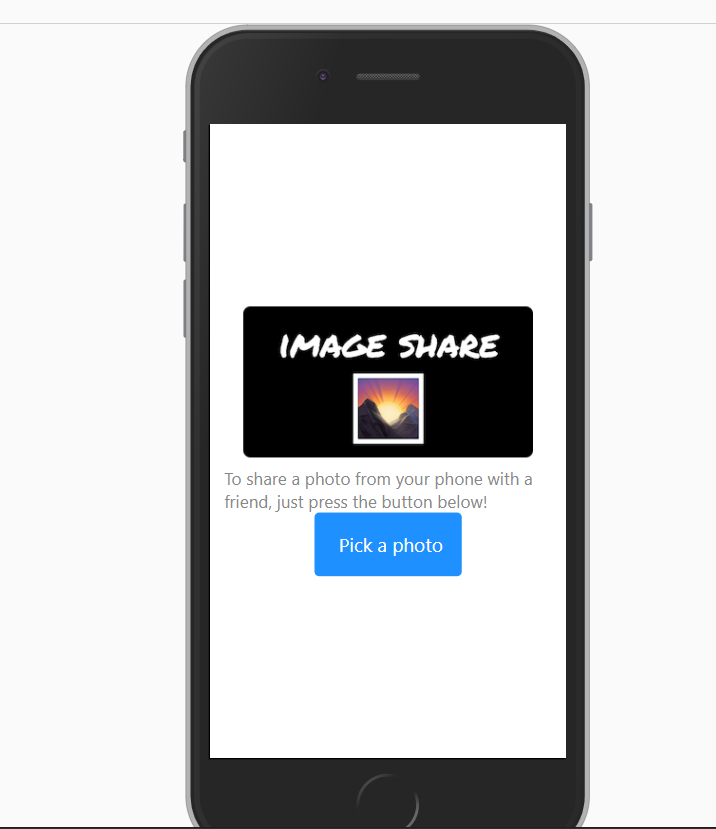

**Coding a simple SharingPhotos App with \***React-Native**_ through _**Expo**\* platform**

 

> Using React-Native APIs like: expo-image-picker, expo-sharing or anonymous-files
>
> Improving launching App Screen with expo-splash-screen
>
> Testing mobile rendering with Expo App

 

 
 
 

Thx to [Expo.io Tutorial](https://docs.expo.io/tutorial/planning/) 😉
